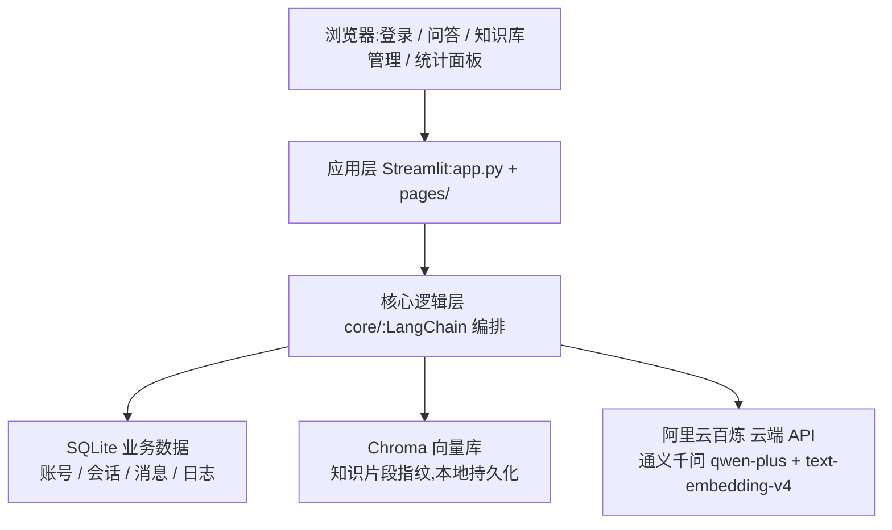
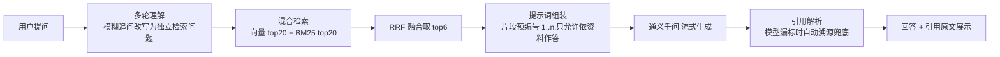

# 🛒 电商智能问答 RAG 系统(企业级,基于 LangChain)

面向电商商品知识库的企业级 RAG 问答系统:上传商品资料 → 自动入库 → 带引用来源的精准问答,支持多用户、多会话、权限管理与数据统计。校招 AI 应用方向实战项目。

> 📂 代码仓库:[GitHub](https://github.com/blfkz/DM----RAG) | [Gitee 码云](https://gitee.com/blfkz/langchain-rag)

## 项目亮点(实测数据)

| 指标 | 数据 | 说明 |
|---|---|---|
| 🚀 100 人并发压测 | **99% 成功率 · 平均 3.47s · 吞吐 5.2 问/秒** | 自研压测工具实测,1722 条原始数据留档 |
| ⚡ 混合检索 | **单次检索约 0.16s** | 向量 + BM25 双路召回、RRF 融合,精确型号与语义近义都能命中 |
| 🎯 防幻觉 | **回答只依据检索到的真实资料** | 提示词硬约束 + [n] 引用标注 + 无引用自动溯源兜底 |
| 🧪 质量保障 | **60 项单元测试全部通过** | pytest,覆盖认证/分块/引用/检索/会话/解析等 7 组核心零件 |
| 🗄️ 数据清洗 | **双清洗能力** | 文档型(SHA256 去重+多编码兼容)+ 结构化表格(pandas 4 规则) |

## 架构一览



**RAG 问答流水线**



## 功能清单

1. **知识库管理**:6 种格式文档上传(PDF/Word/TXT/Markdown/Excel/CSV)、后台处理状态实时可见、SHA256 重复上传拦截、删除同步清理向量
2. **RAG 问答**:回答带 [n] 引用角标并可展开查看原文片段;模型漏标引用时自动溯源兜底;支持多轮追问(自动理解上下文)
3. **多用户多会话**:会话互相隔离,历史对话持久化,重启/换时间登录都能找回
4. **账号体系**:注册/登录/修改密码(PBKDF2-HMAC-SHA256 加盐哈希,30 万次迭代);admin 专属知识库管理与统计面板
5. **统计面板**:用户/知识库/文档/提问/好评率指标卡片、14 天提问趋势、操作日志、问答点赞点踩
6. **数据清洗**:文档型清洗(SHA256 去重、utf-8/utf-8-sig/gbk 多编码兼容、空行清理)+ 结构化表格清洗专项(见 scripts/data_cleaning_demo.py)

## 核心技术决策

| 决策点 | 方案 | 理由 |
|---|---|---|
| 混合检索 | 向量检索 + BM25 关键词检索,RRF 融合取 top6 | 精确型号词走 BM25、语义近义词走向量,互补召回;RRF 是业界标准融合算法 |
| 防幻觉 | 提示词硬约束(只依据资料作答、资料不足明确说"没有找到")+ 片段预编号让模型"抄编号" | 模型不自己数编号,引用稳定;兜底溯源保证任何回答都有可见来源 |
| 中文分块 | RecursiveCharacterTextSplitter + 中文标点分隔,500 字/80 字重叠 | 避免商品信息被切烂,参数行不被拆散 |
| 多轮追问 | 结合最近 6 条历史把模糊追问改写为独立检索问题 | 上下文窗口可控,Token 不随对话膨胀 |
| 纯云端 AI | 大模型与向量化全部走阿里云百炼 API,本机零负担 | 低配电脑流畅运行;架构与正式企业系统一致 |
| 性能优化 | 流式输出、云端批处理、BM25 索引缓存、SQLite WAL+索引、后台线程入库、限流自动重试 | 压测验证:100 并发平均 3.47s、检索 0.16s |

## 测试与压测

```bash
# 单元测试:60 项,覆盖认证/分块/引用/检索/会话/解析/文件指纹 7 组核心零件
.venv\Scripts\python -m pytest tests/ -v

# 自研压力测试:100 人并发实测(网页抽查/单发基线/热身/主场景/并发登录 5 场景)
.venv\Scripts\python scripts\stress_test.py              # 全部场景(约 5 分钟,调用云端 API 约 1 元)
.venv\Scripts\python scripts\stress_test.py --smoke      # 自测模式(零费用感)
```

压测特点:**临时库隔离**(正式数据零污染)、费用确认门、分阶段耗时统计(检索/生成/引用/落库)、失败分类(429 限流/超时/数据库锁)。原始数据存 `scripts/stress_reports/`(CSV,可直接分析绘图)。实测结论:100 人并发成功率 99%,瓶颈在云端免费额度 QPS 限流,本地检索与数据库零失败。

## 快速开始

### 1. 环境准备
- 安装 Python 3.11+(https://www.python.org/downloads/),安装时勾选"Add to PATH"
- 注册阿里云账号并开通[百炼大模型服务](https://bailian.console.aliyun.com/),创建 API Key

### 2. 配置
```bash
copy .env.example .env   # 然后编辑 .env,把 DASHSCOPE_API_KEY 换成你的 Key
```

### 3. 安装依赖
```bash
python -m venv .venv
.venv\Scripts\pip install -r requirements.txt
```

### 4. 启动
```bash
.venv\Scripts\streamlit run app.py
```
浏览器打开 http://localhost:8501(Windows 也可双击 start.bat)

### 5. 登录
- 管理员:admin / 123456(登录后请尽快修改密码)
- 普通用户:注册页自行注册

## 使用说明

**管理员流程**:登录 admin → 「📚 知识库管理」新建知识库 → 上传商品文档(状态变为 ✅ 成功即入库完成);没有文档可先用演示数据脚本一键生成;到「📊 统计面板」看数据。

**用户流程**:注册登录 → 「💬 知识库问答」新建会话 → 选择检索范围 → 提问。回答中蓝色上标 [1][2] 即引用标记,点击下方"📚 引用来源"展开原文;可点赞/点踩、导出会话。

## 常用脚本

| 脚本 | 作用 |
|---|---|
| `scripts/make_sample_data.py` | 一键生成 10 大品类约 40 份演示商品文档(6 种文件格式) |
| `scripts/import_sample_data.py` | 把演示文档按品类自动建库入库(可重复运行,已存在自动跳过) |
| `scripts/data_cleaning_demo.py` | 数据清洗专项:脏电商数据表 → 4 条规则逐步清洗 → 干净数据(无需 API Key) |
| `scripts/stress_test.py` | 自研 100 人并发压测工具(5 场景,数据隔离,费用确认门) |
| `scripts/reset_data.py` | 一键重置全部数据,恢复全新状态 |
| `scripts/test_api.py` | 百炼 API 连通测试(向量化 + 大模型) |

## 目录结构

```
app.py              入口页(登录/注册/改密)
pages/              功能页:1_qa 问答、2_kb_manage 知识库管理、3_stats 统计面板
core/               核心逻辑(纯 Python 分层,便于测试与讲解):
                    config 配置、database 数据层、auth 认证、loader 文档解析、
                    splitter 中文分块、embedding 云端向量化、vectorstore 向量库、
                    retriever 混合检索(BM25+向量+RRF)、rag_chain 编排、
                    citation 引用解析、session_store 会话、ingest 后台入库
utils/              文件指纹、操作日志、页面守卫
scripts/            演示数据、清洗专项、压测工具、重置脚本
tests/              60 项单元测试(pytest)
data/               运行时数据(数据库/向量库/上传文件)
```

## 常见问题

| 现象 | 处理 |
|---|---|
| 回答报"余额不足" | 前往百炼控制台充值或领取免费额度 |
| 上传 PDF 显示"失败:扫描版" | 扫描版 PDF 是图片无法提取文字,请用文字版 PDF |
| 8501 端口被占用 | `streamlit run app.py --server.port 8502` 换个端口 |
| 首次提问较慢 | 正常:首次检索需构建关键词索引(约 1 秒),之后检索约 0.16s |
| 想彻底重来 | 停止应用后运行 `scripts/reset_data.py`,重启即可(admin 会重新自动创建) |

## Docker 部署(可选)

```bash
docker build -t rag-shop .
docker run -p 8501:8501 -v %cd%\data:/app/data rag-shop
```

## 线上部署(云服务器,一键脚本)

提供 `deploy.sh` 一键部署脚本:自动安装 Python 环境、拉取代码、装依赖、注册开机自启服务(崩溃自动重启)。**上线只需三步**(面试前 10 分钟即可完成):

1. 购买阿里云轻量应用服务器(系统镜像选 Ubuntu 22.04;2 核 2G 足够;可选按量计费,用完释放零续费),防火墙放行 8501 端口(TCP)
2. 打开服务器网页终端(Workbench),粘贴执行(国内服务器用码云地址,海外服务器用 GitHub 地址):
   ```bash
   curl -fsSL https://gitee.com/blfkz/langchain-rag/raw/main/deploy.sh | bash
   # 或:curl -fsSL https://raw.githubusercontent.com/blfkz/DM----RAG/main/deploy.sh | bash
   ```
3. 按提示粘贴百炼 API Key,脚本自动完成全部部署 → 浏览器访问 `http://服务器公网IP:8501`

> 服务器上生成演示数据:`cd ~/rag-shop && .venv/bin/python scripts/make_sample_data.py && .venv/bin/python scripts/import_sample_data.py`(需调用百炼向量化 API,约几分钟)。
